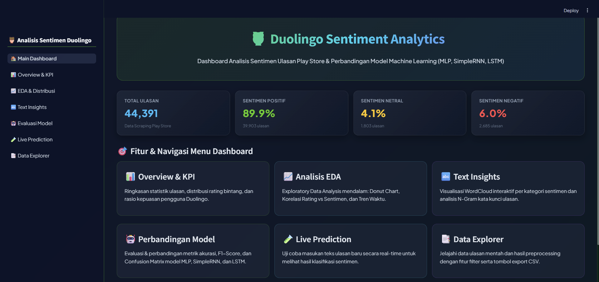

# Duolingo Sentiment Analysis 🦉




This project focuses on performing sentiment analysis on user reviews of the Duolingo application on the Google Play Store (specifically targeting Indonesian reviews). The project encompasses the complete pipeline from **Data Scraping**, **Data Preprocessing & Lexicon Labeling**, **Machine Learning & Deep Learning Modeling** (MLP, SimpleRNN, LSTM), to an **Interactive Streamlit Web Dashboard** featuring a modern, glassmorphic UI.

---

## 🗂️ Project Structure

```
Analisis_Sentimen_Duolingo/
 ├── main.py                     # Main Streamlit web application entry point
 ├── prd.md                      # Product Requirement Document for the Streamlit dashboard
 ├── requirements.txt            # Clean list of project dependencies
 ├── README.md                   # Project documentation
 ├── .gitignore                  # Git ignore file for cache, env, and temporary files
 ├── .streamlit/                 # Streamlit configuration (custom sidebar navigation)
 ├── src/                        # UI Theme and Utility modules
 │    ├── __init__.py
 │    ├── themes.py              # Glassmorphism CSS & Vibrant Duolingo Color Palette
 │    └── utils.py               # Cached data loader, text preprocessor, & sidebar renderer
 ├── pages/                      # Multi-Page Navigation Modules (Streamlit)
 │    ├── overview.py            # Overview & KPI summary cards
 │    ├── eda.py                 # Exploratory Data Analysis & Rating vs Sentiment
 │    ├── text_insights.py       # Interactive WordCloud & Top 15 Word Frequency
 │    ├── model_evaluation.py    # Model benchmarking (MLP vs SimpleRNN vs LSTM)
 │    ├── live_prediction.py     # Real-time interactive sentiment inference
 │    └── data_explorer.py       # Data explorer with multi-column filter & CSV export
 └── data/                       # Datasets & Jupyter Notebooks
      ├── Scraping_Duolingo.ipynb        # Play Store review scraper notebook
      ├── Analisis_Sentimen_Duolingo.ipynb# NLP & ML/DL training notebook
      ├── duolingo_review.csv            # Scraped raw review dataset (~45,000 rows)
      └── processed_review.csv           # Preprocessed dataset with sentiment labels
```

---

## 🚀 Workflow & Features

### 1. Data Scraping
Reviews were scraped from the Google Play Store (`com.duolingo`) using the `google-play-scraper` library. Key attributes such as review text (`content`) and star ratings (`score`) were saved to `data/duolingo_review.csv`.

### 2. Data Preprocessing & Text Cleansing
Indonesian review texts undergo a thorough NLP preprocessing pipeline:
- **Data Cleaning**: Dropping missing values (`NaN`), unneeded columns, and duplicate entries.
- **Lowercasing & Cleansing**: Removing URLs, special symbols, punctuation, and numerical noise.
- **Slang Replacement**: Normalizing informal Indonesian slang and typos into standard words.
- **Tokenization & Stopword Removal**: Splitting sentences into token arrays and removing low-information Indonesian stopwords.
- **Stemming / Lemmatization**: Applying `MPStemmer` (developed specifically for the Indonesian language) to convert words into their base forms.

### 3. Data Labeling & Sentiment Categorization
Reviews are categorized into three sentiment classes based on rating scores and lexicon analysis:
- 🟢 **Positif**: Score 4–5 Stars
- 🟡 **Netral**: Score 3 Stars
- 🔴 **Negatif**: Score 1–2 Stars

### 4. Machine Learning & Deep Learning Modeling
Three algorithms are trained and evaluated on the preprocessed texts:
1. **MLPClassifier (Multi-Layer Perceptron)** + TF-IDF Vectorizer
2. **SimpleRNN (Recurrent Neural Network)** + Keras Embedding
3. **LSTM (Long Short-Term Memory)** + Keras Embedding *(Best Model: 88.5% Accuracy)*

---

## 📊 Interactive Streamlit Dashboard (`main.py`)

The application features a modern **Glassmorphism UI** inspired by RAGsume, incorporating a single unified sidebar menu with 6 interactive pages:

1. **📊 Overview & KPI**: Key statistics (Total reviews, average rating, percentage of positive, neutral, and negative sentiment).
2. **📈 EDA & Distribution**: Donut charts, star rating vs sentiment cross-tabulation, and review length histograms.
3. **🔤 Text Insights & WordCloud**: Interactive WordClouds for Positive, Neutral, and Negative sentiments alongside Top 15 word frequency bar charts.
4. **🤖 Model Evaluation**: Benchmarking bar charts, metric comparison tables (Accuracy, Precision, Recall, F1-Score), and Confusion Matrix heatmaps.
5. **🧪 Live Prediction**: Real-time interactive text input form to predict review sentiment with confidence probability gauges.
6. **📑 Data Explorer**: Interactive data table with keyword searching, sentiment filtering, star rating filtering, and CSV export.

---

## 🛠️ Installation & Dependencies

Install all required Python packages using `requirements.txt`:

```bash
pip install -r requirements.txt
```

Key dependencies: `streamlit`, `pandas`, `numpy`, `plotly`, `matplotlib`, `wordcloud`, `scikit-learn`, `tensorflow`, `nltk`, `emoji`, `google-play-scraper`, `mpstemmer`.

---

## ▶️ How to Run

### 1. Launch the Streamlit Web Application (Recommended)
To run the interactive dashboard locally:

```bash
streamlit run main.py
```

Open `http://localhost:8501` in your browser.

### 2. Run Notebooks (Optional)
- **Scraping**: Open `data/Scraping_Duolingo.ipynb` to re-scrape new reviews from the Play Store.
- **Training & Analysis**: Open `data/Analisis_Sentimen_Duolingo.ipynb` to execute the full NLP preprocessing, lexicon labeling, and model training workflow.
